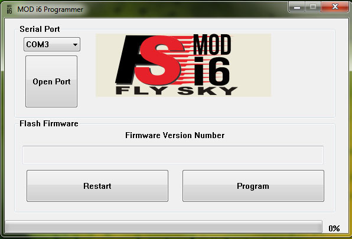
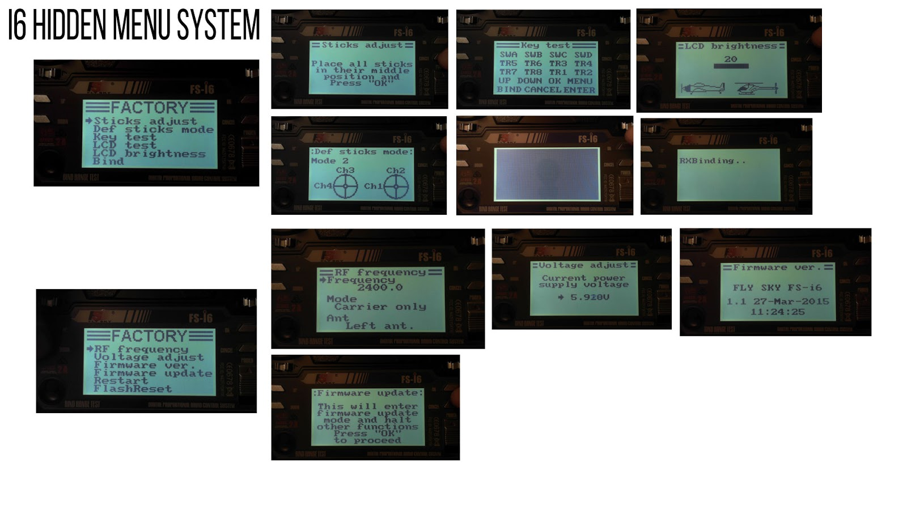
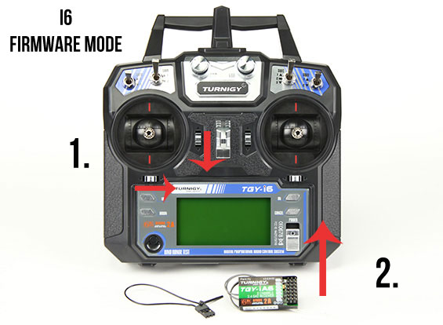
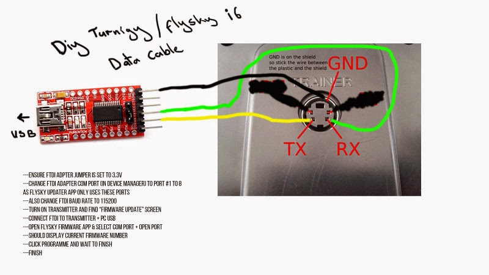

# FlySky-i6-Mod-

A collection of software modifications for the FlySky i6, some useful, some experiment. All use of this repository is experimental and you use at your own risk. But, progress is being made.

Project goals:
- Increase number of channels (using PPM or ibus)
- Enable Mavlink/APM Telemetry (using ia6b receiver)
- Ability to edit TX Voltage reading & alarm (allowing lithium battery power)
- Edit duration of 1 minute 'inactive' alarm
- Functional Flight Timer

Notable thanks to contributors:
Povlhp, ThomHpl, DBorthwick, Benbojangles

/-----------------------------------------------------------------------------------------------------/

At present we have the following achievements using the FlySky i6:
- We are able to flash different official firmware to the i6 and explore each new firmware
- there are hidden menus to change things like: e.g: tx voltage measurement, stick centering etc

- there is secret way to enter firmware update mode 
- flashing the i6 using trainer port - to - FTDI/UART does not affect the bootloader code (as is understood 17/11/2015)

- flashing the i6 using it's internal DEBUG PORT/JTAG is possible to change the bootloader, collect eeprom data, and change firmware
- There is a guide to FTDI flashing i6 with different official firmware: (http://dalybulge.blogspot.co.uk/2015/10/turnigyflysky-i6-secret-menu.html?view=classic)
- There is a guide to flashing i6 for 8ch mod using Jtag(https://github.com/ThomHPL/FSi6_updater) Also guide (https://basejunction.wordpress.com/2015/09/13/en-flysky-i6-part-3-firmware-patching/)
- Experiments using Arduino IDE v1.6.6 are ongoing (https://www.arduino.cc/en/Main/Software), with Teensyduino Add-on (https://www.pjrc.com/teensy/teensyduino.html) (Settings > Board > Teensy LC > 48mhz) (LCD example: ST7565)

More will be added/edited as progress is made. Please send me PM me if you have changes/updates: 
email:i6mods@gmail.com
RCgroups.com:Benbojangles
Diydrones.com:Benbojangles
http://dalybulge.blogspot.co.uk/2015/10/turnigyflysky-i6-secret-menu.html?view=classic
