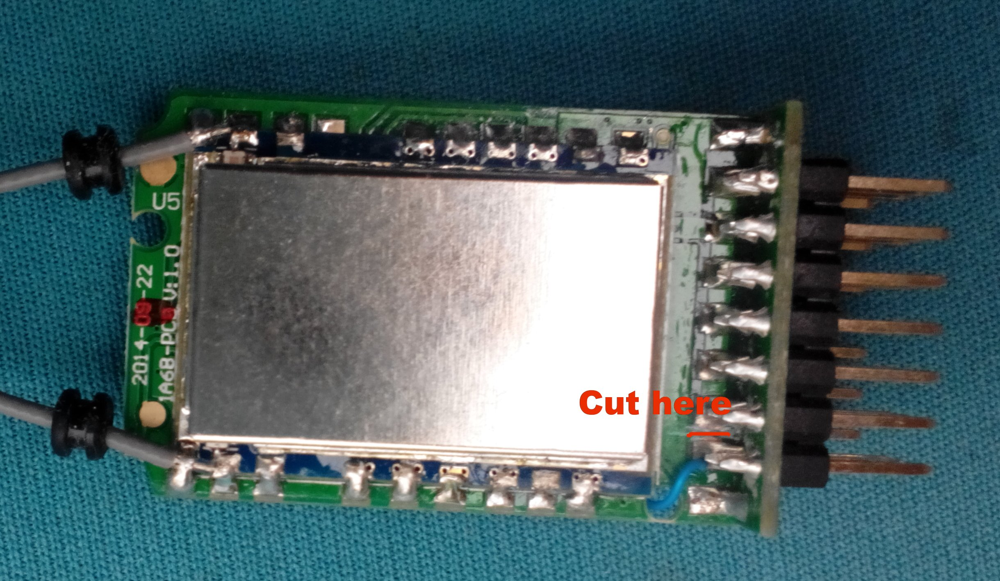
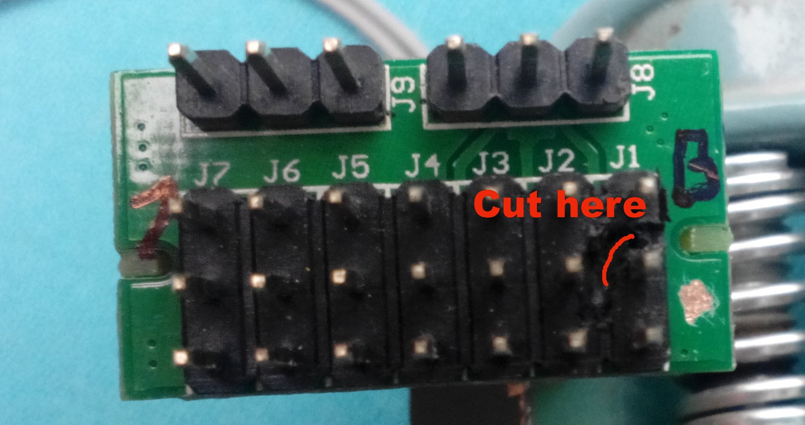
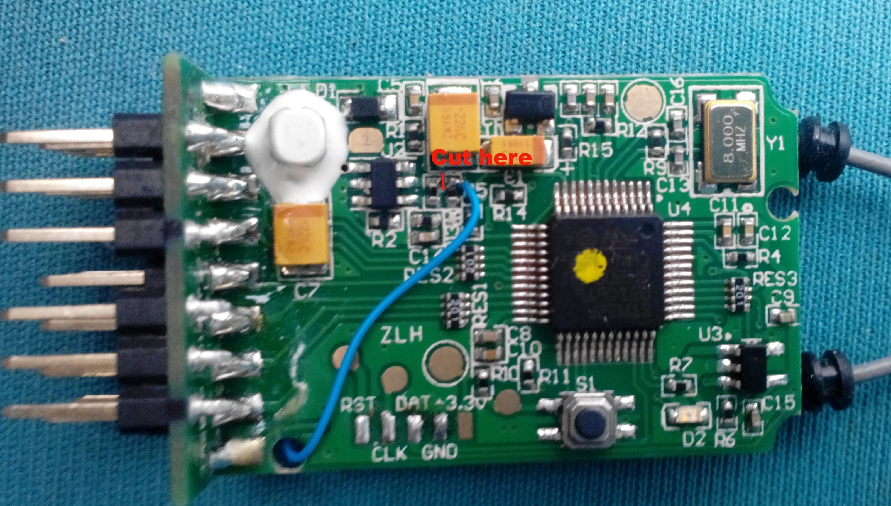

# iA6B Voltage Sensor Mod

This mod of the ia6b receiver allows you to obtain flight pack voltage readings (3s/4s packs) and send the value to the i6 transmitter. It's very accurate , whitin 0.01V.

It is better than the standard 5v reading from the BEC the i6 provided **and** it means you do not need the:
* FlySky FS-CVT01
* Turnigy TGY-CVT01
* Turnigy TGY-AVT01

# The iA6B mod:
We will be modifying the *Bind/Vcc* pin header, and severing the stock voltage sense trace on the iA6B for this mod.

1. You need to first cut the trace on the back.

1. To make the second cut you will need to remove the plastic pin spacer.
*You may also melt or cut the plastic around the pin if you have difficultly with removal.*

*It is very important to double check your work. Make sure the front __and__ back trace have been cut or you may fry your receiver and/or other connected components!*
If done correctly, the middle pin will no longer be electrically connected to **any other middle pin**. Use a multi-meter!

1. One final cut, then you can join the now isolated pin to the newly available voltage divider.

Tried with 3s, the voltage divider is 38.4K + 10K, feel free to try on 4s. Some hot glue for fixing the wire is recommended.
If you have trouble setting the alarm and low voltage levels for your battery, you may add an additional resistor between the pin and voltage divider. Recommended 47k Ohm will show *half* the value, or 91k will show a *third* the value.

Discussion and more at [RC Groups](http://www.rcgroups.com/forums/showpost.php?p=33432940&postcount=23)
